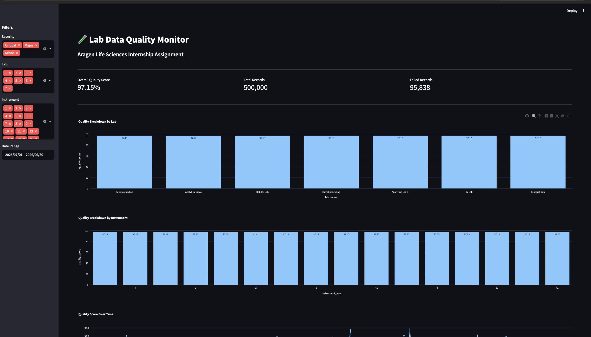
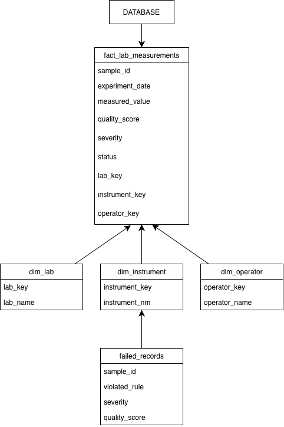
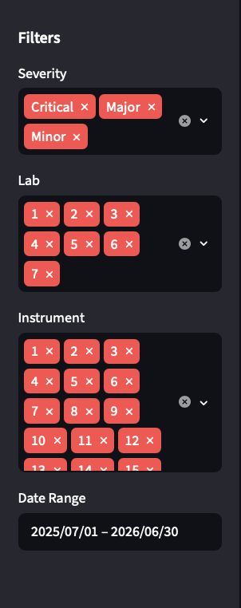
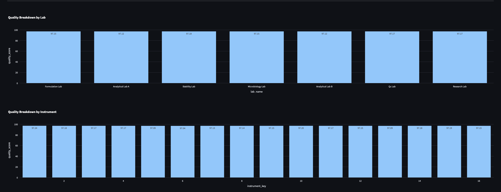
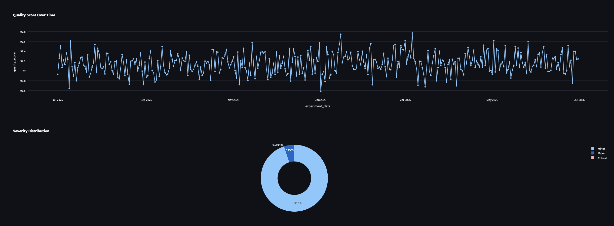
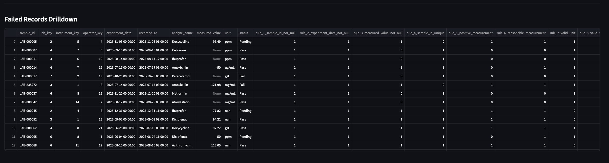

# 🧪 Lab Data Quality Monitor


[](https://aragen-lab-data-quality-monitor-ephu6jrh58bpnng2zjus3n.streamlit.app)

## Aragen Life Sciences Internship Assignment

### Candidate Information
- **Name:** Miya Brijesh
- **Project:** Lab Data Quality Monitor
- **Technology Stack:** Python, Pandas, SQLite, Streamlit, Plotly
- **GitHub Repository:** [aragen-lab-data-quality-monitor](https://github.com/miyabrijesh/aragen-lab-data-quality-monitor)
- **Live Dashboard:** [Streamlit Deployment](https://aragen-lab-data-quality-monitor-ephu6jrh58bpnng2zjus3n.streamlit.app)

---

# 📌 Project Overview

This project implements an end-to-end **Data Quality Monitoring System** for laboratory measurement data. The solution simulates a real-world pharmaceutical laboratory environment where large volumes of experimental records are generated, validated, scored, stored, and monitored through an interactive dashboard.

The project covers:

- Synthetic data generation
- ETL pipeline implementation
- Data quality rule validation
- Quality score calculation
- Failed record identification
- SQLite data warehouse creation
- Interactive Streamlit dashboard
- Cloud deployment using Streamlit Community Cloud

---

## Key Highlights

- Generated ~500,000 synthetic laboratory records
- Implemented 12 automated data quality validation rules
- Built ETL pipeline using Pandas
- Designed SQLite star-schema warehouse
- Developed interactive Streamlit dashboard
- Achieved overall dataset quality score of 97.15%
- Deployed solution on Streamlit Community Cloud

---

## Dashboard Preview



---
## Dataset Availability

The project was developed using a synthetic laboratory dataset containing approximately 500,000 records.

Large dataset and database artifacts may exceed GitHub's recommended file size limits and therefore may not be included in version control.

The repository includes:

- Source code
- ETL notebooks
- Dashboard implementation
- Documentation

The dashboard was developed and validated using the complete dataset locally.
---

# 🏗️ Project Architecture



---

# 📂 Project Structure

```text
Aragen_Assignment/
│
├── dashboard/
│   └── app.py
│
├── data/
│   └── lab_data.csv
│
├── database/
│   ├── lab_quality.db
│   └── lab_quality_task3.db
│
├── docs/
│   ├── dashboard_overview.png
│   ├── dashboard_filter.png
│   ├── dashboard_chart1.png
│   ├── dashboard_chart2.png
│   ├── dashboard_failed_records.png
│   └── Aragen Life Sciences Internship Assignment.docx
│
├── src/
│   ├── 01_dataset_generation.ipynb
│   ├── 02_etl_pipeline.ipynb
│   └── 03_data_quality_rules.ipynb
│
├── README.md
└── requirements.txt
```

---

# 📊 Dataset Generation

A synthetic pharmaceutical laboratory dataset was generated to simulate laboratory operations and quality monitoring scenarios.

### Dataset Includes

- Sample IDs
- Laboratory Information
- Instrument Information
- Operator Information
- Experiment Dates
- Recording Timestamps
- Analyte Information
- Measurement Values
- Units
- Status Indicators

### Dataset Size

```text
Approximately 500,000 synthetic laboratory records
```

### Introduced Data Quality Issues

To test the monitoring framework, intentional quality issues were injected:

- Missing measurements
- Invalid measurement ranges
- Future experiment dates
- Timestamp inconsistencies
- Invalid units
- Duplicate records

---

# ⚙️ ETL Pipeline

The ETL process was implemented using Python and Pandas.

## Extract

- Read raw laboratory dataset.

## Transform

- Data cleaning
- Data type conversion
- Null handling
- Date standardization
- Quality preparation

## Load

- Store processed records into SQLite database tables.

---

# ✅ Data Quality Rules

The following business rules were implemented.

## Rule 1: Missing Measurement Values

Checks:

```sql
measured_value IS NULL
```

Severity:

```text
Major
```

---

## Rule 2: Invalid Measurement Range

Checks:

```sql
measured_value < 0
OR
measured_value > allowed_threshold
```

Severity:

```text
Critical
```

---

## Rule 3: Future Experiment Date

Checks:

```sql
experiment_date > current_date
```

Severity:

```text
Critical
```

---

## Rule 4: Timestamp Validation

Checks:

```sql
recorded_at < experiment_date
```

Severity:

```text
Major
```

---

## Rule 5: Invalid Units

Checks:

```sql
unit NOT IN approved_units
```

Severity:

```text
Minor
```

---

## Rule 6: Duplicate Sample IDs

Checks:

```sql
duplicate sample_id
```

Severity:

```text
Major
```

---

# 🎯 Quality Score Calculation

Each record is evaluated against all quality rules. The score reflects the proportion of rules passed.

### Formula

```text
Quality Score = (Rules Passed ÷ Total Rules) × 100
```

### Severity Classification

Severity is assigned based on the resulting score:

| Score Range | Severity |
|-------------|----------|
| < 50        | Critical |
| 50 – 79     | Major    |
| ≥ 80        | Minor    |

Score Range:

```text
0 to 100 (rounded to 2 decimal places)
```

---

# 🗄️ Database Design

SQLite was used as the analytical database.

## Fact Table

### fact_lab_measurements

Stores:

- Sample information
- Quality scores
- Validation results
- Severity classifications

---

## Dimension Tables

### dim_lab

Laboratory information.

### dim_instrument

Instrument information.

### dim_operator

Operator information.

---

## Failed Records Table

### failed_records

Stores all records that violated one or more quality rules.

---

# 📈 Dashboard Features

An interactive Streamlit dashboard was developed to monitor laboratory data quality.

### Features

- Overall Quality Score KPI
- Total Records KPI
- Failed Records KPI
- Quality Breakdown by Lab
- Quality Breakdown by Instrument
- Quality Trend Analysis
- Severity Distribution
- Failed Records Drilldown
- Interactive Filtering

---

# 🔍 Interactive Filters

The dashboard supports the following filters:

### Severity

```text
Critical
Major
Minor
```

### Lab

Filter by laboratory.

### Instrument

Filter by instrument.

### Date Range

Filter records using experiment dates.

---

# 📸 Dashboard Screenshots

## Dashboard Overview

Shows:

- Overall Quality Score
- Total Records
- Failed Records
- Quality Breakdown by Lab


---

## Dashboard Filters

Shows:

- Severity Filter
- Lab Filter
- Instrument Filter
- Date Range Filter



---

## Quality Breakdown Analytics

This section includes:

- Quality Breakdown by Lab
- Quality Breakdown by Instrument



---

## Trend and Severity Analytics

This section includes:

- Quality Score Over Time
- Severity Distribution



---

## Failed Records Drilldown

Displays detailed failed records with rule violations and quality issues.



---

# 🚀 Deployment

The application was deployed using **Streamlit Community Cloud**.

### Live Dashboard

https://aragen-lab-data-quality-monitor-ephu6jrh58bpnng2zjus3n.streamlit.app

### GitHub Repository

https://github.com/miyabrijesh/aragen-lab-data-quality-monitor

---

# 🛠️ Technologies Used

| Technology | Purpose |
|------------|----------|
| Python | Core Development |
| Pandas | Data Processing |
| NumPy | Numerical Operations |
| SQLite | Data Storage |
| Streamlit | Dashboard Development |
| Plotly | Interactive Visualizations |
| Git | Version Control |
| GitHub | Repository Hosting |
| Streamlit Cloud | Deployment |

---

# ⚖️ Tool Selection: Pandas vs PySpark

**Choice: Pandas**

| Factor | Pandas | PySpark |
|---|---|---|
| Dataset size | Efficient for < 5M rows in memory | Optimal for 10M+ rows across clusters |
| Setup complexity | Zero — runs locally or in Colab | Requires JVM, Spark context, more config |
| Development speed | Fast iteration in Jupyter notebooks | Verbose; DAG compilation adds overhead |
| Memory at 500K rows | ~150–200 MB — well within limits | Spark overhead exceeds data size at this scale |
| Production readiness | Fine for single-node pipelines | Required for distributed, multi-node ETL |

**Justification:** At 500,000 rows (~150 MB in memory), Pandas handles the full dataset comfortably on a single machine without memory issues. PySpark's benefits — lazy evaluation, the Catalyst optimizer, distributed partitioning — only pay off at significantly larger scales (tens of millions of rows across multiple nodes). Introducing PySpark here would add JVM startup overhead, verbose syntax, and unnecessary infrastructure complexity for no measurable performance gain. Pandas was the right tool for this scale.

*Note: If this pipeline were to scale to 50M+ rows across multiple labs in real time, PySpark with partitioned Parquet output on a cloud lakehouse (e.g., AWS S3 + Glue) would be the appropriate upgrade path.*

---

# 📋 Installation Guide

Clone repository:

```bash
git clone https://github.com/miyabrijesh/aragen-lab-data-quality-monitor.git
```

Navigate to project:

```bash
cd aragen-lab-data-quality-monitor
```

Install dependencies:

```bash
pip install -r requirements.txt
```

Run dashboard:

```bash
streamlit run dashboard/app.py
```

---
# 📦 Bonus Implementation – Parquet Partitioning

As an additional enhancement, the processed laboratory dataset was exported in Apache Parquet format and partitioned by laboratory name.

### Partition Structure

```text
parquet/
└── fact_lab_measurements/
    ├── lab_name=Analytical Lab A/
    ├── lab_name=Analytical Lab B/
    ├── lab_name=Formulation Lab/
    ├── lab_name=Microbiology Lab/
    ├── lab_name=QC Lab/
    ├── lab_name=Research Lab/
    └── lab_name=Stability Lab/
```

### Benefits

- Faster analytical queries

- Reduced storage footprint compared to CSV

- Efficient partition pruning

- Scalable design for large datasets

- Industry-standard format for data engineering workflows

---

# Future Enhancements

- Real-time data ingestion
- Automated alerting system
- Email notifications
- Predictive quality analytics
- Role-based access control
- Cloud database integration
---

# 🎉 Key Outcomes

Successfully implemented:

✅ Synthetic laboratory dataset generation

✅ ETL pipeline development

✅ Automated data quality validation

✅ Quality score calculation framework

✅ SQLite analytical database

✅ Interactive Streamlit dashboard

✅ Dynamic filtering capabilities

✅ Failed record monitoring

✅ GitHub repository integration

✅ Streamlit Cloud deployment

---

# 📌 Conclusion

This project demonstrates a complete Data Quality Monitoring framework for laboratory environments. The solution validates incoming records, identifies quality issues, calculates quality scores, tracks quality trends, and provides an interactive monitoring interface for stakeholders.

The architecture is modular, scalable, and can be extended for real-world pharmaceutical and laboratory data quality monitoring applications.

---

## 🔗 Quick Links

**GitHub Repository**

https://github.com/miyabrijesh/aragen-lab-data-quality-monitor

**Live Streamlit Dashboard**

https://aragen-lab-data-quality-monitor-ephu6jrh58bpnng2zjus3n.streamlit.app
